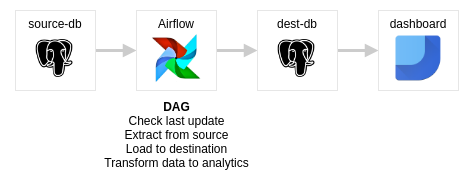
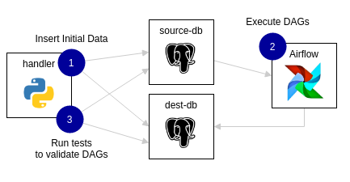

# Airflow Testing with CI workflow

This code is complementar to my article [How to build a DataOps enviroment with Airflow (Part 1): setup CI/CD and DAG pipeline tests](https://medium.com/@marcosmarxm/how-to-build-a-dataops-enviroment-with-airflow-part-1-setup-ci-cd-and-dag-pipeline-tests-13cdf050439e).
I suggest you to read to better understand the code and the way I think how to setup the project.

## The project

Below is a summary of what will be accomplished in this project. We simulate the transfer of fictitious transaction data from an ecommerce from the `source-db` database to the `dest-db` database.


To assist in the development we use a local development environment and also CI integration with Github Action. Below is the sequence of execution of the stages of operations in the project.


- Airflow: container running local setup for dev;
- source-db and dest-db: container that simulate banks in a production environment and receive fake data;
- handler: python image that has scripts for initial data loading and also serves as a "controlled environment" for testing.

### Dependencies?
Docker, docker-compose and makefile.

### How to run?

The command below will raise the environment using docker-compose. Wait a few minutes (240s, yeah omg right?) For correct Airflow configuration then create the necessary credentials and connections. Finally, insert the initial data into the mock banks.
```
make setup
```
By running the above command it is possible to access Airflow at `localhost: 8080`. A user of test user: admin / password: admin is created. At this stage you can develop your DAGs and test them as you modify them.

The command below executes a call for Airflow to run the DAGs that have already been created and have tests. If you develop a new DAG you must insert it here when you run the tests and CI it is invoked.
```
make run
```

And finally, the command that calls the container handler to run the tests.
```
make tests
```
---

Some resources about Airflow testing and DataOps:
* [Pipelines on pipelines: Agile CI/CD workflows for Airflow DAGs @ Airflow Summit 2020](https://www.youtube.com/watch?v=tY4F9X5l6dg)
* [Data Testing with Airflow](https://github.com/danielvdende/data-testing-with-airflow)
* [Data's Inferno: 7 Circles of Data Testing Hell with Airflow](https://medium.com/wbaa/datas-inferno-7-circles-of-data-testing-hell-with-airflow-cef4adff58d8)
* [Testing and Debugging in Apache Airflow by GoDataDriven](https://godatadriven.com/blog/testing-and-debugging-apache-airflow/)
* [The Challenge of Testing Data Pipelines](https://medium.com/slalom-build/the-challenge-of-testing-data-pipelines-4450744a84f1)
* [Automated Testing for Proceting Data Pipeliens from Undocumented Assumptions](https://www.youtube.com/watch?v=z-kPgEAJCrA&ab_channel=Databricks)
