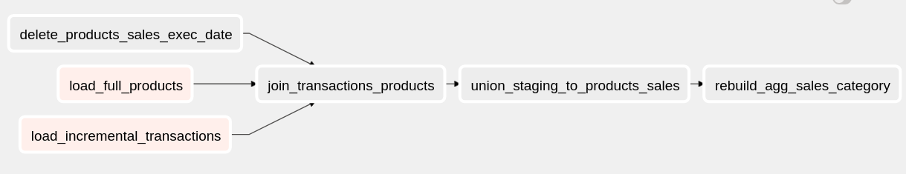
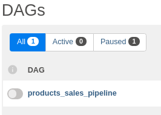
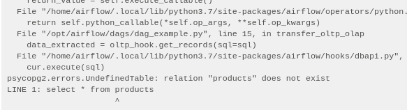
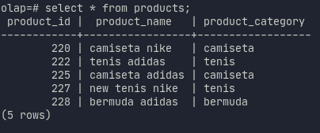

# Tutorial explaining how to develop a DAG using TDD

## Introduction.
In this tutorial we'll build the DAG requested in the project from the beginning. If you want to follow along I advise you to clone the repository and checkout to the branch `tutorial`.
```
git clone git@github.com:marcosmarxm/airflow-testing-ci-workflow.git
git checkout tutorial
```
To get the most out of it you must have a basic knowledge of **Airflow, python and pytest**.
In case you don't know, I think ... as we build gradually, maybe you can go on researching and learning the concepts right away.

Recalling the pipeline that we'll develop:



Explaining each task:
- **load_full_products**: deletes the old data and loads the `products` table completely every day.
- **load_incremental_purchases**: due to the size of this table, an incremental load will be performed using the `execution_date` data parameter.
- **join_purchase_products_as_product_sales_daily**: this intermediary task prepares the raw data (products and purchases) loaded from the `oltp` database to be stored in the` product_sales` results table that will be used by the analytics team.
- **delete_products_sales_exec_date**: this task has the function of clearing the data from the `product_sales` result table at the beginning of the pipeline, thus ensuring that there will be no duplicate data (idempotency).
- **union_staging_to_products_sales**: load the data from the staging `product_sales_daily` to the table with historical data ` product_sales`.
- **rebuild_agg_sales_category**: the result of the table above already illustrates a standard consumption format for a data warehouse, this task illustrates a creation of a simplified "data mart".

## Let's start!
First, let's get our development environment up and running.
If you have doubts about the environment, I recommend reading the article [link](https://blog.magrathealabs.com/how-to-develop-data-pipeline-in-airflow-through-tdd-test-driven-development-c3333439f358). You can see the code in the file `Makefile`.
```
make setup
```
it will take a few minutes.
The Airflow 2.0 docker image with LocalExecutor is taking too long to do the initial setup.
After the initial configuration, we sent some commands to Airflow: create a user,some connections (oltp-db and olap-db) and variables.

We already have a diagram of the pipeline sketched.
So let's think about how to build it now.
We have also seen the data format and a small sample of it.
With that we have the input to carry out the project's development.

## TASK: Full load product data
The first task that we'll develop is `full_load_product_data`.
It's intended to take data from the `products` table of the` oltp-db` database and transfer it to `olap-db`.
First let's create our fake data to guide us.
Create a file in the `/data` directory called `products.csv`.
You can get the data [here](https://raw.githubusercontent.com/marcosmarxm/airflow-testing-ci-workflow/master/data/products.csv).
Example below:
|product_id|product_name         |product_category|
|----------|---------------------|----------------|
|220       |Brand A T-Shirt      |T-Shirt         |
|222       |Dri-FIT T-Shirt      |T-Shirt         |
|225       |Brand N T-shirt      |T-Shirt         |
|227       |Casual Shoes         |Shoes           |
|228       |Generic Running Shoes|Shoes           |

After that, we'll start the development of DAG using the TDD methodology.
We need to create a test, run it, and it'll fail.
Next we'll code to correct the error.
Entering a looping between test/error/code correction until the pipeline ends.
The advantages are:
- quick feedback of the problem, we'll have only one error to solve;
- gradual building our code certifying that it works.

Create a file in the directory `/tests` called `test_sales_pipeline.py`.
```python
# test_sales_pipeline.py
class TestSalesPipeline:

    def test_validate_sales_pipeline(self):
        assert len(olap_product_size) == 5
```
** Reflecting with myself **: The purpose of this task is to compare the data that will be in the `olap-db` database in the` products` table with the sample data `/data/products.csv`... <br>
`olap_product_size`: it is the variable that I am planning to receive the values that should be transferred, probably that it is a list with values or a pandas dataframe.
Let's start with the most basic possible:
* Compare our `olap_product_size` result and see if it has all the items we expect it to have. As we can see in the sample data `/data/products.csv` we have 5 entries, so we want to compare the size of `olap_product_size` with 5.

We can run our test for the first time using the command:
```
make testing
```
It'll result in an error. The variable `olap_product_size` doesn't exist.
In the project, this variable must retrieve the data from the `olap-db` database in the `products` table.
So, we need to create a connection with the `olap-db` database and retrieve these records.

Since we are using Airflow, we'll use **Hooks** that have several methods to interact with databases.
As we have already configured the container `olap-db` and the connection of Airflow to it in the setup. It'll be very simple to complete this step.
We will use **PostgresHook**, if you want to know more about Hooks you can access the Airflow doc [here](https://airflow.apache.org/docs/apache-airflow/stable/concepts.html?highlight=hook#hooks)
```python
from airflow.providers.postgres.hooks.postgres import PostgresHook

class TestSalesPipeline:

    def test_validate_sales_pipeline(self):
        olap_hook = PostgresHook('olap')
        olap_product_size = olap_hook.get_records(
            'select * from products'
        )
        assert len(olap_product_size) == 5
```
We imported **PostgresHook** and created the hook for the `olap-db` database.
This hook has a method that can execute an SQL query and return its values.
After editing the test file as shown above, we can run `make testing` again.
We'll receive the error that the `products` table doesn't exist in the` olap-db` database.
<br><br>
> **Attention Point** Here comes an important test consideration.
> Our pipeline is responsible for transferring data and not creating these tables.
> So it is part of the test to configure this setup of the tables.
```python
from airflow.providers.postgres.hooks.postgres import PostgresHook

class TestSalesPipeline:

    def test_validate_sales_pipeline(self):
        olap_hook = PostgresHook('olap')
        olap_hook.run('''
        CREATE TABLE IF NOT EXISTS products (
            product_id       INTEGER,
            product_name     TEXT,
            product_category TEXT
        );
        ''')
        olap_product_size = olap_hook.get_records(
            'select * from products'
        )
        assert len(olap_product_size) == 5
```
The `.run(sql statement)` command performs an SQL query on the database. It is similar to the `.get_records` we saw before, however it's for when we do not want the return data.
In the example above, it'll create the table `products` with the necessary columns according to our sample data from `/data/products.csv`.

We ran the tests again and now the error we have is that there is a difference between `olap_product_size` and the value we expect to equal 5.
At this stage we have reached the need to start our DAG because we have already configured our test initially.
We'll create a file called `dag_sales_pipeline.py` inside the `/dags` directory.
```python
from airflow import DAG
from airflow.utils.dates import days_ago

with DAG(dag_id='products_sales_pipeline',
         default_args={'owner': 'airflow'},
         schedule_interval=None,
         start_date=days_ago(2)) as dag:
```
The above code just instance a new DAG.
We need to think now about how to solve our problem.
We need a function that transfers data from the `oltp-db` database to` olap-db`.
We have already seen that **Hooks** in Airflow have methods that can help us: execute a sql and get the data (`get_records`), execute a sql without returning the data (`run`), among other iterations with the database (`insert_rows`, etc).
```python
from airflow import DAG
from airflow.utils.dates import days_ago
from airflow.providers.postgres.hooks.postgres import PostgresHook
from airflow.operators.python import PythonOperator


def transfer_oltp_olap(**kwargs):
    """Get records from OLTP and transfer to OLAP database"""
    dest_table = kwargs.get('dest_table')
    sql = kwargs.get('sql')

    oltp_hook = PostgresHook(postgres_conn_id='oltp')
    olap_hook = PostgresHook(postgres_conn_id='olap')

    data_extracted = oltp_hook.get_records(sql=sql)
    olap_hook.insert_rows(dest_table, data_extracted, commit_every=1000)


with DAG(dag_id='products_sales_pipeline',
         default_args={'owner': 'airflow'},
         schedule_interval=None,
         start_date=days_ago(2)) as dag:

    load_full_products_data = PythonOperator(
        task_id='load_full_products',
        python_callable=transfer_oltp_olap,
        op_kwargs={
            'dest_table': 'products',
            'sql': 'select * from products',
        })
```
Explaining what was accomplished:
1. We created the **task** `load_full_products_data` it's a PythonOperator. An **Operator** is a concept in Airflow that can invoke basic/standardized commands. For example **PythonOperator** calls functions in `python` and **PostgresOperator** can execute SQL queries but cannot transfer data from one database to another. For more information, I recommend reading the [documentation] (https://airflow.apache.org/docs/apache-airflow/stable/concepts.html?highlight=hook#operators).
2. We created the function `transfer_oltp_olap` it basically creates the two hooks to perform the data collection in the` oltp-db` database for `olap-db`. Because we do not use **PostgresOperator** the reason is that the operator can only execute the query at the limit of the bank it is associated with, it does not transfer data. That's why we use hooks. _kwargs_ is an Airflow convention to pass arguments in functions called by **PythonOperator**.

> **Explaining** the `load_full_products_data` functino is using Airflow resources (memoery, cpu) to execute.
Nothing wrong with that, but in a more realistic scenario you should probably call an external service to carry out this transfer, transformation etc. (Cluster Spark / Hadoop, etc.)


After completing the DAG we can access Airflow `localhost:8080` *admin/admin* and verify that we have our first DAG there!



We can activate it in the Airflow UI and run it.
It'll have the following error:



We'll evaluate the Airflow log and identify that the table `products` was not found in the database `oltp-db`.
It is the same situation as the previous one, we need to create this table in our test function.
So let's change `test_sales_pipeline.py` again.
```python
from airflow.providers.postgres.hooks.postgres import PostgresHook

class TestSalesPipeline:

    def test_validate_sales_pipeline(self):
        oltp_hook = PostgresHook('oltp')
        oltp_hook.run('''
        CREATE TABLE IF NOT EXISTS products (
            product_id       INTEGER,
            product_name     TEXT,
            product_category TEXT
        );
        ''')

        olap_hook = PostgresHook('olap')
        olap_hook.run('''
        CREATE TABLE IF NOT EXISTS products (
            product_id       INTEGER,
            product_name     TEXT,
            product_category TEXT
        );
        ''')

        olap_product_size = olap_hook.get_records(
            'select * from products'
        )
        assert len(olap_product_size) == 5
```
We created the hook to access `oltp-db` and created the `products` table in it.
We ran the test and got the same error that the size is different from 5.
However, now we have our DAG and the `products` table in both databases.
If we execute the DAG in the Airflow UI it will be successful in execution.
Now we need to have it run during our test.

Airflow offers several commands through its **cli** (commands execute in the terminal). The command `airflow dags backfill --start_date DAG_ID` allows you to trigger a DAG on a specific date. [Link to the documentation](https://airflow.apache.org/docs/apache-airflow/stable/dag-run.html#backfill).
This command is perfect for our case. <br>
We can execute this command in the terminal... so we'll take advantage of Python and execute it using the _subprocess_ library.
```python
import subprocess
from airflow.providers.postgres.hooks.postgres import PostgresHook

def execute_dag(dag_id, execution_date):
    """Execute a DAG in a specific date this process wait for DAG run or fail to continue"""
    subprocess.run(["airflow", "dags", "backfill", "-s", execution_date, dag_id])

class TestSalesPipeline:

    def test_validate_sales_pipeline(self):
        oltp_hook = PostgresHook('oltp')
        oltp_hook.run('''
        CREATE TABLE IF NOT EXISTS products (
            product_id       INTEGER,
            product_name     TEXT,
            product_category TEXT
        );
        ''')

        olap_hook = PostgresHook('olap')
        olap_hook.run('''
        CREATE TABLE IF NOT EXISTS products (
            product_id       INTEGER,
            product_name     TEXT,
            product_category TEXT
        );
        ''')
        date = '2020-01-01'
        execute_dag('products_sales_pipeline', date)

        olap_product_size = olap_hook.get_records(
            'select * from products'
        )
        assert len(olap_product_size) == 5
```
We created a function to help us invoke the execution of the DAG during the test.
So when we run `make testing` it'll automatically run the DAG with the date we passed, in the case` 2020-01-01`.

The test will return **FAILED**. <br>
We've already created the two tables, however the `oltp-db` database has no records.
We need to be able to insert the fake data into it.
We've  created the file `/data/products.csv` we need to transport the data into `oltp-db`.
The simplest way that comes to mind is to read the *csv* file using the _pandas_ library and transfer the data to the database using the _pandas_ API.
```python
import subprocess
import pandas as pd
from airflow.providers.postgres.hooks.postgres import PostgresHook


def execute_dag(dag_id, execution_date):
    """Execute a DAG in a specific date this process wait for DAG run or fail to continue"""
    subprocess.run(["airflow", "dags", "backfill", "-s", execution_date, dag_id])


class TestSalesPipeline:

    def test_validate_sales_pipeline(self):
        oltp_hook = PostgresHook('oltp')
        oltp_hook.run('''
        CREATE TABLE IF NOT EXISTS products (
            product_id       INTEGER,
            product_name     TEXT,
            product_category TEXT
        );
        ''')

        oltp_conn = oltp_hook.get_sqlalchemy_engine()
        sample_data = pd.read_csv('./data/products.csv')
        sample_data.to_sql(
            name='products',        # name of sql table
            con=oltp_conn,          # SQLalchemy connection
            if_exists='replace',    # refresh data if run again
            index=False             # dont want the pandas index inside db table
        )

        olap_hook = PostgresHook('olap')
        olap_hook.run('''
        CREATE TABLE IF NOT EXISTS products (
            product_id       INTEGER,
            product_name     TEXT,
            product_category TEXT
        );
        ''')
        date = '2020-01-01'
        execute_dag('products_sales_pipeline', date)

        olap_product_size = olap_hook.get_records(
            'select * from products'
        )
        assert len(olap_product_size) == 5
```
As I mentioned, Airflow hooks have several methods that help in communication and operations with database. In this case we easily create an *SQLAlchemy engine* for _pandas_ to send the data from *csv* to the `products` table in the` oltp-db` database.

Now, a moment of tension... we execute `make testing` again... AND OUR **TEST PASSED!**<br>
The 1 warning is due to the Airflow hook using the old Postgresql connection format.
```
======================== 1 passed, 1 warning in 11.06s =========================
```

To really check, we can access the `olap-db` database through the command in the terminal:
```
docker exec -ti olap-db psql -U root olap
```
and then running `select * from products` we'll get the following result.



Very well! Finally we have our DAG doing the first task as we expect.
We now need to develop the next tasks.
As we already have the alirce built, it'll be faster and simpler to carry out the next tasks.

> **Attention point: we created a very simplistic test**. <br>
It would be better to do a comparison that guarantees the result of the DAG is compatible with the data that we really expect.
In this task, we want the data in the `products` table in the` olap-db` database to be the same as the `/data/products.csv` file. Let's do this now.
```python
import subprocess
import pandas as pd
from pandas._testing import assert_frame_equal
from airflow.providers.postgres.hooks.postgres import PostgresHook


def execute_dag(dag_id, execution_date):
    """Execute a DAG in a specific date this process wait for DAG run or fail to continue"""
    subprocess.run(["airflow", "dags", "backfill", "-s", execution_date, dag_id])


class TestSalesPipeline:

    def test_validate_sales_pipeline(self):
        oltp_hook = PostgresHook('oltp')
        oltp_hook.run('''
        CREATE TABLE IF NOT EXISTS products (
            product_id       INTEGER,
            product_name     TEXT,
            product_category TEXT
        );
        ''')
        oltp_conn = oltp_hook.get_sqlalchemy_engine()
        sample_data = pd.read_csv('./data/products.csv')
        sample_data.to_sql('products', con=oltp_conn, if_exists='replace', index=False)

        olap_hook = PostgresHook('olap')
        olap_hook.run('''
        CREATE TABLE IF NOT EXISTS products (
            product_id       INTEGER,
            product_name     TEXT,
            product_category TEXT
        );
        ''')
        date = '2020-01-01'
        execute_dag('products_sales_pipeline', date)

        olap_product_size = olap_hook.get_records(
            'select * from products'
        )
        assert len(olap_product_size) == 5

        # New test!
        olap_product_data = olap_hook.get_pandas_df('select * from products')
        assert_frame_equal(olap_product_data, sample_data)
```
1. we import `from pandas._testing import assert_frame_equal` to help us compare a pandas dataframe.
2. we created the variable `olap_product_data` using the hook again but now returning the database data as a dataframe.
4. as we had already loaded the data from the file `/data/products.csv` into the variable` sample_data` it made it easier to perform the comparison.

Now finally a test that really compares if what we hope is running.

**Now we need to stop, think and breathe.** <br>
Looking at the next task (`load_incremental_purchases`) it'll have the same steps.
In the test code there are several parts that can be refactored, modularized in functions and reused for the next task.
Lets do this. The activities to be carried out:
* transfer the sql commands to files leaving the code more organized;
* we will create specific files for the **expected** result that we'll compare with the result of the tasks.
* the function (`create_table`) that creates a table in a given database, it receives the name of the sql file (described in the item above) which will also be the name of the table and the database hook to perform the operation;
* the function (`insert_initial_data`) that inserts the initial data into the specified table;
* the function (`output_expected_as_df`) that takes the expected data to compare with the result of the DAG.

First let's put the scripts for creating the tables in files.
Create a file in the path and named: `/sql/init/create_products.sql`
```sql
CREATE TABLE IF NOT EXISTS products (
    product_id       INTEGER,
    product_name     TEXT,
    product_category TEXT
);
```
Create a `expected` folder within `/data`.
In this case we will just duplicate the `products.csv` file into it.

After these steps we are back to editing our test.

```python
import subprocess
import pandas as pd
from pandas._testing import assert_frame_equal
from airflow.providers.postgres.hooks.postgres import PostgresHook


def execute_dag(dag_id, execution_date):
    """Execute a DAG in a specific date this process wait for DAG run or fail to continue"""
    subprocess.run(["airflow", "dags", "backfill", "-s", execution_date, dag_id])


def insert_initial_data(tablename, hook):
    """This script will populate database with initial data to run job"""
    conn_engine = hook.get_sqlalchemy_engine()
    sample_data = pd.read_csv(f'/opt/airflow/data/{tablename}.csv')
    sample_data.to_sql(name=tablename, con=conn_engine, if_exists='replace', index=False)


def create_table(tablename, hook):
    sql_stmt = open(f'/opt/airflow/sql/init/create_{tablename}.sql').read()
    hook.run(sql_stmt)


def output_expected_as_df(filename):
    return pd.read_csv(f'/opt/airflow/data/expected/{filename}.csv')


def execute_dag(dag_id, execution_date):
    """Execute a DAG in a specific date this process wait for DAG run or fail to continue"""
    subprocess.run(["airflow", "dags", "backfill", "-s", execution_date, dag_id])


class TestSalesPipeline:

    def test_validate_sales_pipeline(self):
        oltp_hook = PostgresHook('oltp')
        create_table('products', oltp_hook)
        insert_initial_data('products', oltp_hook)

        olap_hook = PostgresHook('olap')
        create_table('products', olap_hook)

        date = '2020-01-01'
        execute_dag('products_sales_pipeline', date)

        olap_product_size = olap_hook.get_records('select * from products')
        assert len(olap_product_size) == 5

        expected_product_data = output_expected_as_df('products')
        olap_product_data = olap_hook.get_pandas_df('select * from products')
        assert_frame_equal(olap_product_data, expected_product_data)

```
Our refactored test with functions that will be reused in the next steps.
It is much more readable separated into functions.
Take time and study the change that has occurred.
For those who are starting to understand and pioneer this refactoring process will help a lot. (If you have a cruel question you can send me a message about this)

## TASK: Load incremental purchases
Let's start the next task!
The only difference from it to the previous one is that it'll have a condition in the data load.
We should just load the data for the execution day, `execution_date`.
First let's create our file with fake data.
Create the `purchases.csv` file inside the `/data` directory.
You can get the data by clicking [here](https://raw.githubusercontent.com/marcosmarxm/airflow-testing-ci-workflow/master/data/purchases.csv)
|purchase_id|purchase_date|user_id|product_id|unit_price|quantity|total_revenue|
|--------------|-------------|-------|----------|----------|--------|-------------|
|1             |2020-01-01   |111    |222       |150.0     |2       |300.0        |
|2             |2020-01-01   |101    |225       |75        |1       |75           |
|3             |2020-01-01   |153    |228       |300       |1       |300          |
|4             |2020-01-10   |111    |227       |500       |1       |500          |
|5             |2020-01-10   |199    |222       |150       |3       |450          |
|6             |2020-01-10   |182    |220       |35        |4       |140          |
|7             |2020-01-10   |174    |222       |150       |1       |150          |
|8             |2020-01-15   |166    |227       |500       |1       |500          |
|9             |2020-01-15   |132    |225       |75        |1       |75           |
|10            |2020-01-15   |188    |220       |35        |10      |350          |

Below is our test file (functions and imports have been removed to decrease the size).
We have started a new test phase again.
```python
class TestSalesPipeline:

    def test_validate_sales_pipeline(self):
        oltp_hook = PostgresHook('oltp')
        olap_hook = PostgresHook('olap')

        create_table('products', oltp_hook)
        create_table('products', olap_hook)
        insert_initial_data('products', oltp_hook)

        date = '2020-01-01'
        execute_dag('products_sales_pipeline', date)

        # Test load_full_products task
        olap_products_size = olap_hook.get_records('select * from products')
        assert len(olap_products_size) == 5

        expected_products_data = output_expected_as_df('products')
        olap_products_data = olap_hook.get_pandas_df('select * from products')
        assert_frame_equal(olap_products_data, expected_products_data)

        # New code!
        # Test load_incremental_purchases
        olap_purchases_size = olap_hook.get_records('select * from purchases')
        assert len(olap_purchases_size) == 3
```
The column of data that corresponds to time is called `purchase_date`.
So if we analyze the sample data we have only 3 entries for date `2020-01-01`.
This date we are already using when we call our DAG, variable `date = '2020-01-01`.

I will anticipate some steps that we have already taken with the previous DAG. I will create the purchase table in both databases and populate the `oltp-db` database with the fake data we created. The following lines have been included:
```python
# test_sales_pipeline
class TestSalesPipeline:

    def test_validate_sales_pipeline(self):
        oltp_hook = PostgresHook('oltp')
        olap_hook = PostgresHook('olap')

        create_table('products', oltp_hook)
        create_table('products', olap_hook)
        insert_initial_data('products', oltp_hook)

        create_table('purchases', oltp_hook)
        create_table('purchases', olap_hook)
        insert_initial_data('purchases', oltp_hook)
```

Let's add the new task to DAG.

```python
from airflow import DAG
from airflow.utils.dates import days_ago
from airflow.providers.postgres.hooks.postgres import PostgresHook
from airflow.operators.python import PythonOperator


def transfer_oltp_olap(**kwargs):
    """Get records from OLTP and transfer to OLAP database"""
    dest_table = kwargs.get('dest_table')
    sql = kwargs.get('sql')
    params = kwargs.get('params')

    oltp_hook = PostgresHook(postgres_conn_id='oltp')
    olap_hook = PostgresHook(postgres_conn_id='olap')

    data_extracted = oltp_hook.get_records(sql=sql, parameters=params)
    olap_hook.insert_rows(dest_table, data_extracted, commit_every=1000)


with DAG(dag_id='products_sales_pipeline',
         default_args={'owner': 'airflow'},
         schedule_interval=None,
         start_date=days_ago(2)) as dag:

    execution_date = '{{ ds }}'

    load_full_products_data = PythonOperator(
        task_id='load_full_products',
        python_callable=transfer_oltp_olap,
        op_kwargs={
            'dest_table': 'products',
            'sql': 'select * from products',
        })

    load_incremental_purchases_data = PythonOperator(
        task_id='load_incremental_purchases',
        python_callable=transfer_oltp_olap,
        op_kwargs={
            'dest_table': 'purchases',
            'sql': 'select * from purchases where "purchase_date" = %s',
            'params': [execution_date]
        })
```
A new PythonOperator task called `load_incremental_purchases_data` has been created. It reuses the previously function.
The only difference is the `where purchase_data =% s` clause.
And editing the function to receive the extra parameter in the query.
The `{{ds}}` syntax is an Airflow convention for accessing context variables.
There are several variables that can be accessed within the context of DAG.
It's kind of obscure at first, for more information read the documentation about [Macros Reference](https://airflow.apache.org/docs/apache-airflow/stable/macros-ref.html).

We can run our tests now.
Our second task is completed.
Again we can increase our test to better serve the project.

In this case, we will create the file with the expected data.
Instead of copying the `purchases.csv` file as with product data, we will now only need a subset relevant to the tests.
Create a new file called `purchases_2020-01-01.csv` inside the` expected` folder.
|purchase_id|purchase_date|user_id|product_id|unit_price|quantity|total_revenue|
|--------------|-------------|-------|----------|----------|--------|-------------|
|1             |2020-01-01   |111    |222       |150.0     |2       |300.0        |
|2             |2020-01-01   |101    |225       |75        |1       |75           |
|3             |2020-01-01   |153    |228       |300       |1       |300          |
It will only have data from day 2020-01-01.
Now let's edit our test function.
```python
#test_sales_pipeline.py

# old
olap_purchases_size = olap_hook.get_records('select * from purchases')
assert len(olap_purchases_size) == 3

# new
purchase_data = self.olap_hook.get_pandas_df('select * from purchases')
purchase_size = len(purchase_data)
purchase_expected = output_expected_as_df(f'purchases_{date}')
assert_frame_equal(purchase_data, purchase_expected)
assert purchase_size == 3
```
So we completed the second task.
We arrived at the project stage where we finished the data extraction and loading tasks.
The next tasks will only involve the `olap-db` database.
Now we are going to use another Airflow feature.

## TASK: join_purchases_products
The objective of this task is to join the two tables created previously.
We went back to our test file by creating the new test for the table `join_purchases_products`.
```python
# test_sales_pipeline.py
# ...
purchase_data = self.olap_hook.get_pandas_df('select * from purchases')
purchase_size = len(purchase_data)
purchase_expected = output_expected_as_df(f'purchases_{date}')
assert_frame_equal(purchase_data, purchase_expected)
assert purchase_size == 3

# Test join_purchases_products
purchases_products_size = self.olap_hook.get_pandas_df('select * from join_purchases_products')
assert len(purchases_products_size) == 3
```
Explaining why you expect the result to be 3.
In this join we will take the loaded transactions and make a `left` join with the product table. So the maximum size will be 3.

We can edit the DAG after inserting the test.
```python
from airflow import DAG
from airflow.utils.dates import days_ago
from airflow.providers.postgres.hooks.postgres import PostgresHook
from airflow.providers.postgres.operators.postgres import PostgresOperator
from airflow.operators.python import PythonOperator

def transfer_oltp_olap(**kwargs):
    # não foi alterado nesse momento

with DAG(dag_id='products_sales_pipeline',
         default_args={'owner': 'airflow'},
         schedule_interval=None,
         template_searchpath='/opt/airflow/sql/sales/',
         start_date=days_ago(2)) as dag:

    execution_date = '{{ ds }}'

    load_full_products_data = PythonOperator(
        task_id='load_full_products',
        python_callable=transfer_oltp_olap,
        op_kwargs={
            'dest_table': 'products',
            'sql': 'select * from products',
        })

    load_incremental_purchases_data = PythonOperator(
        task_id='load_incremental_purchases',
        python_callable=transfer_oltp_olap,
        op_kwargs={
            'dest_table': 'purchases',
            'sql': 'select * from purchases where "purchase_date" = %s',
            'params': [execution_date]
        })

    join_purchases_with_products = PostgresOperator(
        task_id='join_purchases_products',
        postgres_conn_id='olap',
        sql='join_purchases_with_products.sql'
    )

    [load_full_products_data, load_incremental_purchases_data] >> join_purchases_with_products
```
1. `template_searchpath='/opt/airflow/sql/sales/'` which was inserted in the instantiation of the DAG. This command allows you to load SQL scripts from another folder.
2. **PostgresOperator** as we'll now transform the data that is in the `olap-db` database, we can use Operator.
3. Finally, the task dependency connection was made.

We need to create our SQL file with the query.
Create it in the `/sql/sales/join_purchases_with_products.sql` directory.
Why the `init` and` sales` folder? I like to leave the files separated by these logical segments where they are used.
```sql
create table if not exists join_purchases_products as (
    select
        t.*,
        p.product_name,
        p.product_category
    from purchases t
    left join products p
        on p.product_id = t.product_id
)
```
After creating the SQL file we can run the tests and we will have our third task completed!
Nearby tasks can be accomplished in the same way using PostgresOperator.
I will leave them as a challenge.
If you have difficulty you can analyze the code that is in the repository to guide you.

---

Thank you very much and if you have any suggestions send me a message [here](https://www.linkedin.com/in/marcos-marx-millnitz/?locale=en_US).
